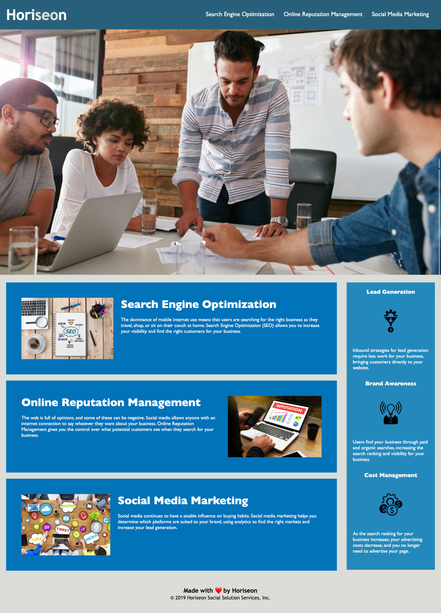
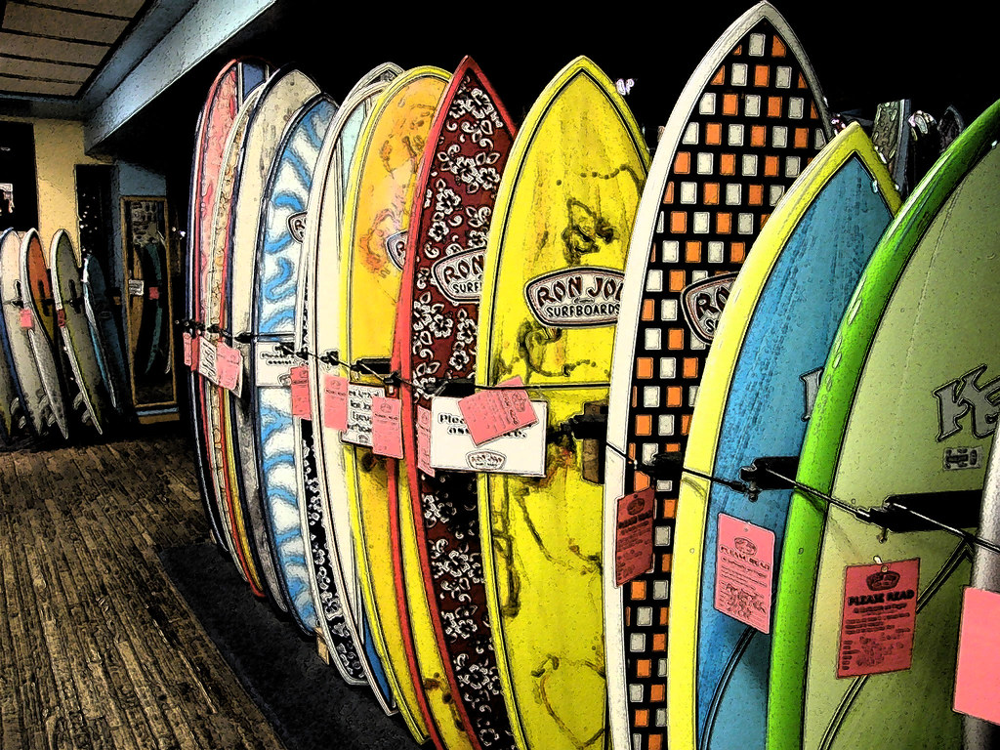
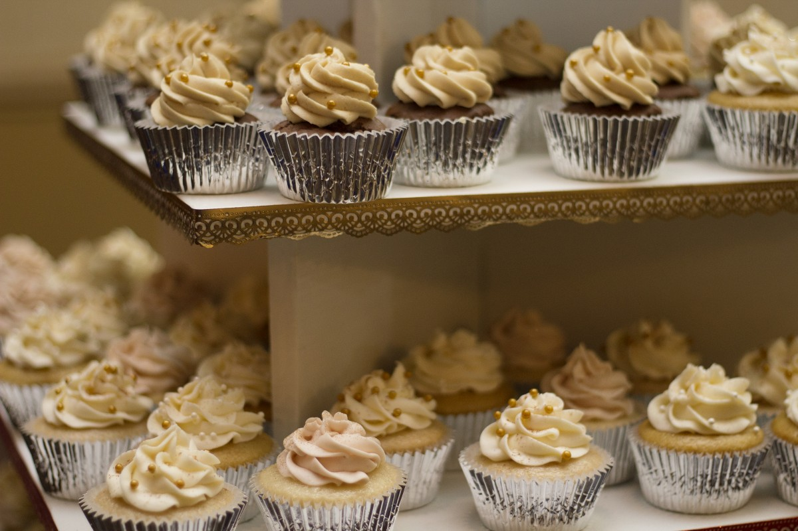
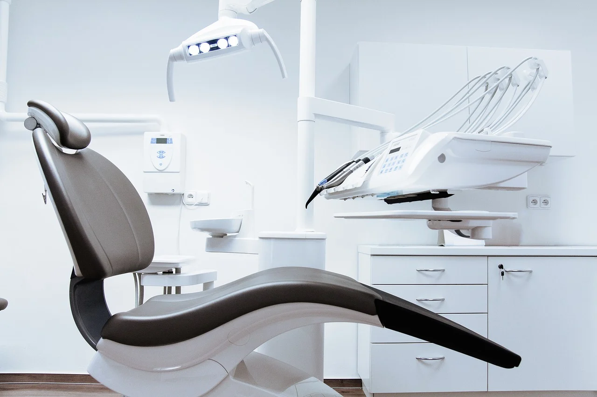
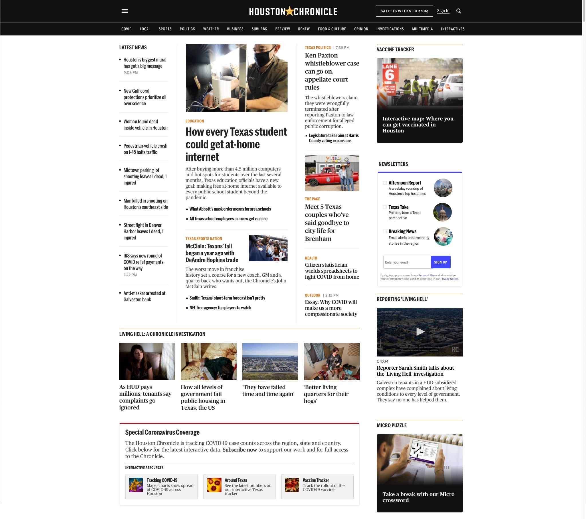

# Portfolio

## About me:

I am a Quality Assurance Engineer 🤖  and a student of the Fullstack Development 💻 Bootcamp at Rice University.
With my limited experience in Web Development, I an creating this project in anticipation of what my projects could look like.

👇🏽 Below is a list of screenshots of my fictitious portfolio:

## Horiseon Accessibility Updates 

## Max Surf Shop Photoshoot 📸
 

## Created a website for "Tootsie Cupcake Shop"

## Created a static webpage for "Smile Dental"

## Quality Assurance Testing at Hearst Newspapers 🗞

